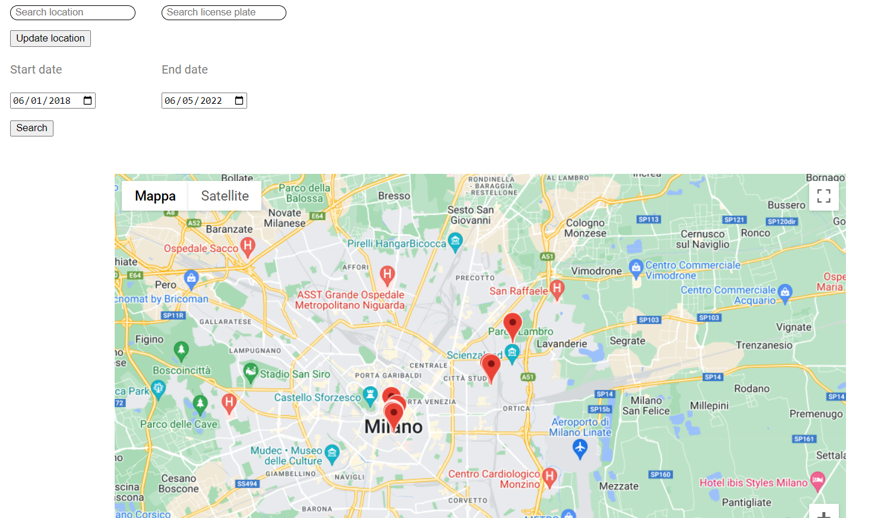

# SafeStreets

</img>

## Description
The goal of this project is to build a crow-sourced android application that provides user with the possibility to notify authorities about parking violations.
The user should be able to report the violation by adding pictures. The violation should be later confirmed or rejected by the municipality.

## Solution
The application structure is based on a client side, the android app, that permits the user to create a report and automatically retrieves info such as position and the plate number from the pictures, and a server side, implemented with Google Firebase, that handles storing and organizing data.
The municipality also has a web interface to approve or reject reports along with a map that shows reports. The website is hosted by Firebase.

The solution is capable of grouping reports of the same violation together based on the position and the plate number.

</img>

### Municipality Web Interface
The municipality web interface can be found at https://safestreets-project.web.app/

## Developers
- Matteo Marchisciana (https://github.com/Marchingegno)
- Dennis Motta (https://github.com/Desno365)
- Andrea Marcer (https://github.com/AndreaMarcer)
